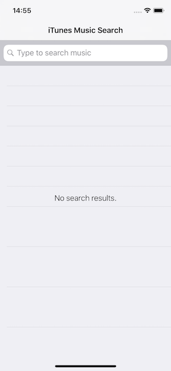
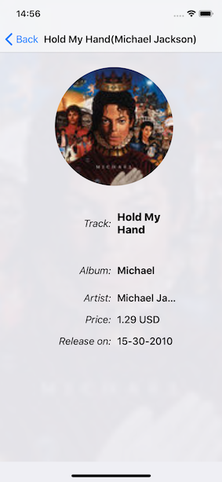

# iTunes Search

A simple application to search through some media content in iTunes.
Works on iPhone and iPad.

## Design

### MVVM
As much as was possible in the given time frame ensured that the view/controllers ask anything or everything about what it is supposed to display to the view model.
Used a single struct TrackViewModel to behave as a view model for both the cells in the master view and the detailview.

### Caching
Was thinkin of implementing a custom cache, but then decided to leverage URLSession's shared cache and bump up its capacity instead. More often than not, its better to leave some things to the OS itself.

### Network communication
To interface with the server even though we could achieve it with a same class, brought in 2 layers.
1. APIManagerInterface
2. NetworkToModelInterpretor.

APIManagerinterface is a set of interfaces(protocol) which the interpretor uses to get low level data, either Data/Dictionary.
The Interpretor's function would be to convert that to model objects that the application would understand.

### Image Fetching - Thumbnails and Tokens
To ensure that we update the correct cell due to the multiple asynchronous requests we may run into situations where we do not know who requested and update the wrong ui object.
To overcome this, I'm using a token based pattern to fetch images in general. So keeping track of the token is an overhead  and deviation from the design that view should never know the corresponding object, but in this case we need to compromise. But its safe and makes the code more robust.
So cell keeps the token to identify the TrackViewModel, so on reciving an image back from network layer we compare the token and update only if there is a match.

### No Singleton
It would have been quicker to simply use singletons to communicate to different parts. But in the bigger picture singletons just create problems. So avoided it consciously. 

### Latest Search Results.
To ensure that only the latest search results was shown.
Followed a simple logic to ensure that the latest search results will be shown by maintaining an instance variable of the latest searched text. i think a more stable logic would be to stop the previous tasks and execute the latest one, instead of currently just disregarding the response.

## Proud of

### Mocking the API
One benifit of using multi layers for network communication is flexibility. Using the idea of dependency Injection by way of constructors/initilizers. The Interpretor would require any type which would comply with the APIManagerInterface protocol. Hence it was easy to mock that protocol for testing. 

### iPhone and iPad support
Used trait based attribute value setting of the stack view to ensure that there is a little difference in the UI design for compact vs regular screen sizes.

### ImageView needed state support
With the number of Image Views in the application, it was important to maintain the state of the image view, and what better way to maintain state than enums. Thank you swift.org for greatly increasing the power of enums, but with great power comes great responsibility. Didn't want to overdo it. 

### Write think re-write think all over again... 
Quite a bit of the code was rewritten and given the chance would rewrite it again, it is a creative process(lesser order) to think of a variety of ways to write some logic. 

### defer to call completion block
In the NetworkAPIManager class, when we are making an asynchronous call, I used defer to call the completion block. This ensures that no matter what the completion gets called and it gets called only once. Many a times had issues with either the completion being called multiple times or not called at all. This prevents all that.

## Improvements
- Wanted to show off test driven development capability, but decided against it as i didnt want to suffer in completing functionality.
- A lot more test cases could have been written to ensure different parts wouldn't break in the course of time. I did a sample of each type of test case, but in a well thought of project I would need to check both positive and negative scenarios a whole lot of functions need test.
- Wanted to resolve the constraint errors when no track is selected.
- Couldn’t do much code commenting for maintainability, but added stuff here and there during my work where i felt like.
- Didn’t even attempt to do backward compatibility.
- Sometimes a thumbnail does not load, it could be due to either the request is timing out or the current logic is unable to update the cell.
- The UI Design though very basic doesn't look good in iPad portrait mode. 
- Would have created an extension on Error to show error messages especially when there is no network and stuff.

## Screenshots - iPad

### iPad Landing Page

### iPad On Search & Track Selection

## Screenshots - iPhone

### iPhone Landing Page

### iPhone On Search

### iPhone On Track Selection

